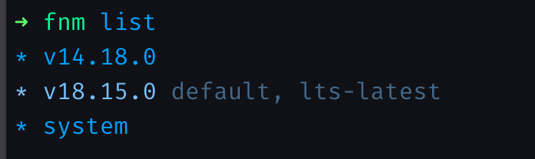
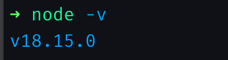

# React + TypeScript + Jest + Parcel 개발 환경 세팅

## fnm으로 Node.js 버전 세팅

원래 nvm을 사용했었는데 이번에 fnm을 알게되어 fnm을 이용해서 Node 버전을 관리하기로 하였다.

노드 버전을 확인하여 최신버전인지 확인한다

```bash
node --version or node -v
```

최신 버전이 아닐 경우에 노드 버전을 최신으로 변경해준다
이때 fnm을 사용하여 노드 버전을 최신화 해준다

fnm이 없다면 설치해서 진행해 준다.
나는 Mac이어서 brew를 이용해서 설치하였다.

```bash
brew install fnm
```

[fnm](https://github.com/Schniz/fnm) github를 이용해서 추가 정보를 확인 할 수 있다.

fnm 설치 후 최신 노드 버전을 설치 해 준다.

```bash
fnm install --lts
```

설치 후 list에서 현재 버전 설치된 정보 확인

```bash
fnm list
```



아래와 같은 명령어로 노드 버전을 명시해서 사용하면 된다.

```bash
fnm use v18.15.0
```

다시 노드 버전을 확인 해 준다.

```bash
node --version or node -v
```



## CRA없이 시작하기

빈 폴더를 하나 만들어 줍니다.

```bash
mkdir my-react-project

cd my-react-project
```

### npm 프로젝트 생성

이제 npm 프로젝트를 생성한다.

```bash
npm init -y
```

### TypeScript 세팅

```bash
npm i -D typescript

npx tsc --init
```

`typescript` 패키지를 설치하고,
`tsconfig.json` 파일을 자동으로 생성한다.

`package.json` 파일에 의존성이 추가된다.

```json
{
  "devDependencies": {
    "typescript": "^5.0.4"
  }
}
```

JSX를 사용하기 위해 `tsconfig.json` 파일을 열어
옵션을 하나 수정한다.

```json
{
  "compilerOptions": {
    // ...(전략)...
    "jsx": "react-jsx",
    // ...(후략)...
  }
}
```

### ESLint 세팅

```bash
npm i -D eslint

npx eslint --init
```

`package.json` 파일에 포함된 의존성이 추가된다.

```json
{
  "devDependencies": {
    // ...(전략)...
    "@typescript-eslint/eslint-plugin": "^5.58.0",
    "@typescript-eslint/parser": "^5.58.0",
    "eslint": "^8.38.0",
    "eslint-config-xo": "^0.43.1",
    "eslint-config-xo-typescript": "^0.57.0",
    "eslint-plugin-react": "^7.32.2",
    // ...(후략)...
  }
}
```

`.eslintrc.js` 파일에 rule을 추가한다.
아샬님이 사용하시는 rule에 현재 내가 프로젝트에서 사용하고 있는 rule도 함께 추가를 해놓았다.

!!!Note 해당 부분에 대해서는 추가로 다듬는 작업이 필요하다.

```javascript
module.exports = {
  // ...(전략)...
  rules: {
    indent: ['error', 2],
    'no-trailing-spaces': 'error',
    curly: 'error',
    'brace-style': 'error',
    'no-multi-spaces': 'error',
    'space-infix-ops': 'error',
    'space-unary-ops': 'error',
    'no-whitespace-before-property': 'error',
    'func-call-spacing': 'error',
    'space-before-blocks': 'error',
    'keyword-spacing': ['error', { before: true, after: true }],
    'comma-spacing': ['error', { before: false, after: true }],
    'comma-style': ['error', 'last'],
    'comma-dangle': ['error', 'always-multiline'],
    'space-in-parens': ['error', 'never'],
    'block-spacing': 'error',
    'array-bracket-spacing': ['error', 'never'],
    'object-curly-spacing': ['error', 'always'],
    'key-spacing': ['error', { mode: 'strict' }],
    'arrow-spacing': ['error', { before: true, after: true }],
    'react/jsx-filename-extension': [2, {
      extensions: ['.js', '.jsx', '.ts', '.tsx'],
    }],
    'no-use-before-define': ['off'],
    '@typescript-eslint/no-use-before-define': ['off'],
    'react/require-default-props': ['off'],
    'react-hooks/exhaustive-deps': ['warn'],
    'react-hooks/rules-of-hooks': 'error',
    'no-console': ['off'],
    'import/no-unresolved': ['off'],
    'import/prefer-default-export': ['off'],
    'react/jsx-props-no-spreading': ['warn'],
    'arrow-parens': ['error', 'as-needed'],
    'no-underscore-dangle': ['off'],
    camelcase: ['off'],
    'no-alert': ['off'],
    'react/jsx-one-expression-per-line': ['off'],
    'jsx-a11y/no-noninteractive-element-interactions': ['off'],
    'jsx-a11y/click-events-have-key-events': ['off'],
    'jsx-a11y/control-has-associated-label': ['off'],
    'jsx-a11y/no-static-element-interactions': ['off'],
    'jsx-a11y/label-has-associated-control': ['off'],
    'no-unused-expressions': ['off'],
    'padded-blocks': ['off'],
    'no-unneeded-ternary': ['off'],
    'no-nested-ternary': ['off'],
    'no-param-reassign': ['off'],
    'jsx-a11y/no-autofocus': ['off'],
    'default-case': ['off'],
    'react/react-in-jsx-scope': ['off'],
  },
};
```

`.eslintignore` lint 체크가 제외되어야 할 파일 및 폴더를 추가한다.

```txt
/node_modules/
/dist/
/.parcel-cache/
```

[eslint-.eslintignore](https://github.com/eslint/eslint/blob/main/.eslintignore)에 추가되어있는 항목도 추가하였다.

### gitignore 추가

`.gitignore`파일을 생성해줍니다.

[github-Node.gitignore](https://github.com/github/gitignore/blob/main/Node.gitignore)에서 파일안에 넣어야할 컨텐츠를 채워줍니다.

해당 파일이 필요한 이유는 리파지토리에 올라가지 말아야하는 파일을 미리 제외하는 작업입니다.

```bash
touch .gitignore
```

### React 설치

```bash
npm i react react-dom
npm i -D @types/react @types/react-dom
```

`package.json` 파일에 포함된 의존성이 추가된다.

```json
{
  "dependencies": {
    "react": "^18.2.0",
    "react-dom": "^18.2.0"
  },
  "devDependencies": {
    // ...(전략)...
    "@types/react": "^18.0.34",
    "@types/react-dom": "^18.0.11",
  }
}
```

## Jest 세팅

```bash
npm i -D jest @types/jest @swc/core @swc/jest \
    jest-environment-jsdom \
    @testing-library/react @testing-library/jest-dom
```

`package.json` 파일에 포함된 의존성이 추가된다.

```json
{
  "devDependencies": {
    "@swc/core": "^1.3.49",
    "@swc/jest": "^0.2.24",
    "@testing-library/jest-dom": "^5.16.5",
    "@testing-library/react": "^14.0.0",
    "@types/jest": "^29.5.0",
    // ...(중략)...
    "jest": "^29.5.0",
    "jest-environment-jsdom": "^29.5.0",
  }
}
```

```bash
touch jest.config.js
```

`jest.config.js` 파일에 아래와 같이 내용을 추가한다.

```javascript
module.exports = {
  testEnvironment: 'jsdom',
  setupFilesAfterEnv: [
    '@testing-library/jest-dom/extend-expect',
    './jest.setup',
  ],
  transform: {
    '^.+\\.(t|j)sx?$': ['@swc/jest', {
      jsc: {
        parser: {
          syntax: 'typescript',
          jsx: true,
          decorators: true,
        },
        transform: {
          react: {
            runtime: 'automatic',
          },
        },
      },
    }],
  },
  testPathIgnorePatterns: [
    '<rootDir>/node_modules/',
    '<rootDir>/dist/',
  ],
};
```

`.eslintrc.js` 파일에 설정 추가한다.

```javascript
module.exports = {
  env: {
    // ...(전략)...
    jest: true,
  },
  // ...(후략)...
};
```

### Parcel 설치

```bash
npm i -D parcel
```

```json
{
  "devDependencies": {
    //...(전략)...
    "parcel": "^2.8.3",
    //...(후략)...
  },
}
```

`package.json`에 아래 `script`와 `main`을 수정해준다.

```json
{
  // ...(전략)...
  "main": "index.js", -> "source": "./index.html",
  "scripts": {
    "start": "parcel --port 8080",
    "build": "parcel build",
    "check": "tsc --noEmit",
    "lint": "eslint --fix --ext .js,.jsx,.ts,.tsx .",
    "test": "jest",
    "coverage": "jest --coverage --coverage-reporters html",
    "watch:test": "jest --watchAll"
  },
  // ...(후략)...
}
```

static image를 사용하려면 아래와 같은 패키지를 설치하고 `.parcelrc`에 설정을 해줘야 한다.

```bash
npm i -D parcel-reporter-static-files-copy
```

```json
{
  "extends": ["@parcel/config-default"],
  "reporters":  ["...", "parcel-reporter-static-files-copy"]
}
```
